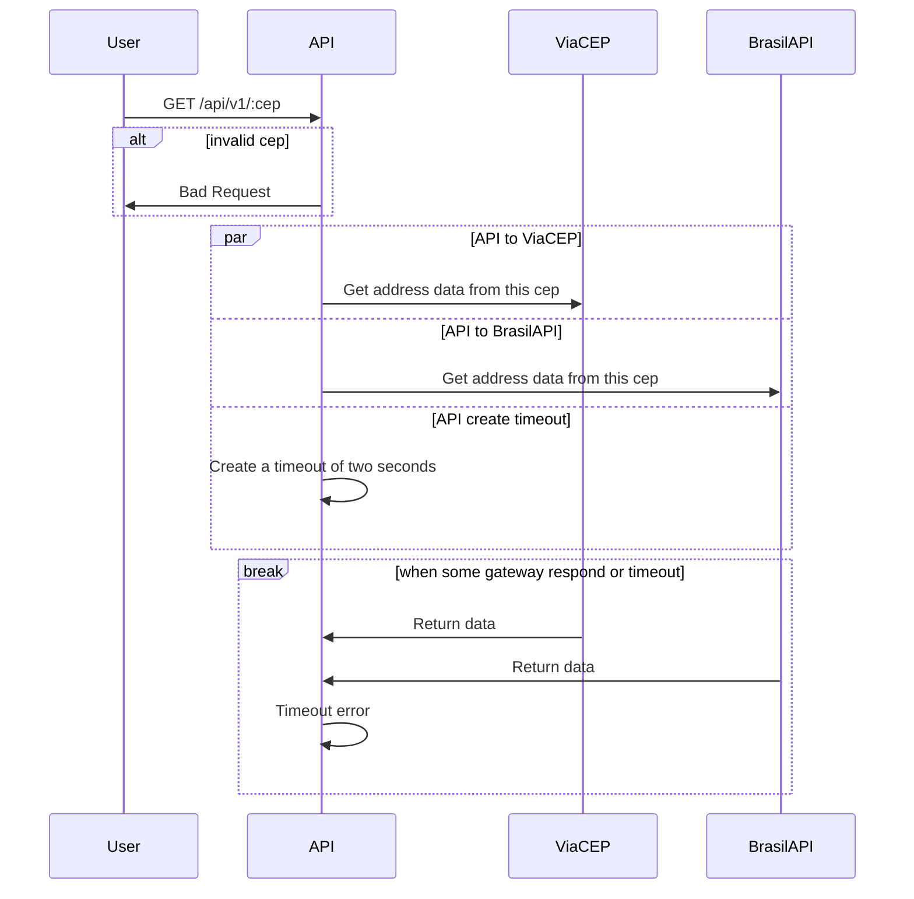

# Go-CEP

## What is?

This project is a simple CEP tracker where the application can call N CEP gateways and return the response from the fastest one, if no  gateway responds within specified time the request will fail with timeout error.

## What you will find in the source code:

1. Redis integration
2. Decorator Pattern
3. Concurrent requests with an timeout after 2 seconds
4. Decoupled layers (Basics of `Ports and Adapters` and `Clean Architeture` concepts)
5. Basic testing (Unit and integration)
6. Docker with multistage build
7. Auto update image in hub.docker with github actions

## Diagram of the aplication

